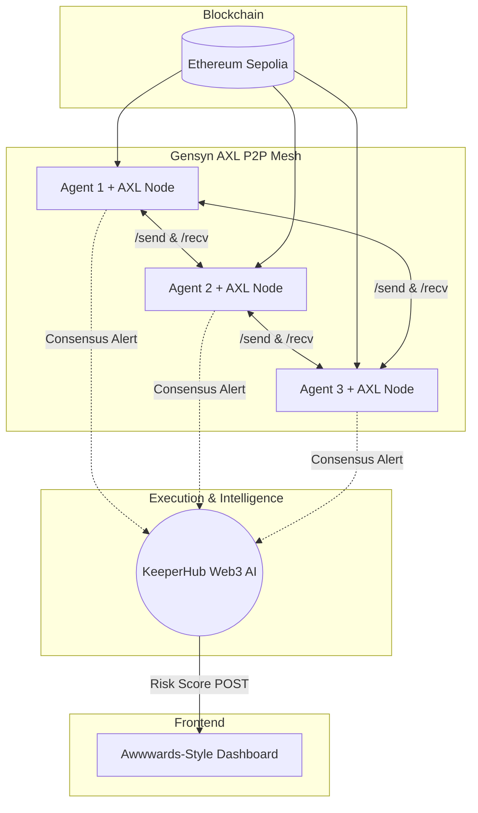

<div align="center">
  
# 🛡️ TriGuard

**A Decentralized Multi-Agent Ethereum Monitoring System**

Built for **ETHOnline 2026** • Featuring **Gensyn AXL** & **KeeperHub**

[](https://triguard-dashboard.onrender.com)
[](https://opensource.org/licenses/MIT)

</div>

---

## ⚡ Overview

**TriGuard** eliminates the single point of failure in blockchain security monitoring. 

Traditional security bots are centralized—if the server goes down, the protocol is left vulnerable. TriGuard solves this by deploying three fully independent AI agents that monitor the Ethereum Sepolia network in real-time. Instead of a centralized database, they communicate purely over **Gensyn AXL's** decentralized peer-to-peer mesh. Only when a Byzantine fault-tolerant "2-of-3" consensus is reached does the system trigger **KeeperHub's** Web3 AI execution layer to formally assess the threat.

---

## 🏆 Hackathon Tracks & Qualifications

### 🌐 Gensyn AXL Track
TriGuard strictly adheres to the AXL requirements:
- **No Centralized Brokers:** We do not use Redis, Kafka, or RabbitMQ.
- **True P2P Communication:** 3 separate AXL node binaries run alongside 3 Python processes. Agents broadcast anomaly votes using AXL's HTTP `/send` and `/recv` endpoints.
- **Yggdrasil Backbone:** Nodes peer over the Gensyn Yggdrasil overlay (`tcp_port: 7000`), proving multi-node routing across the public mesh.

### 🛡️ KeeperHub Track
TriGuard turns KeeperHub into a decentralized execution and intelligence layer:
- **Approach:** We use KeeperHub's **Webhook** as our trigger, mapping raw calldata from our AXL consensus agents into the **Web3 Risk Assessment** AI node.
- **Intelligence Loop:** KeeperHub simulates the transaction, calculates a risk score (0-100), and uses an **HTTP Request** node to POST the result back to our Flask Dashboard (`/api/risk`), closing the loop in real-time.

---

## 🧠 Architecture & Tech Stack



### Stack Breakdown
- **P2P Mesh:** Gensyn AXL (Golang Binaries)
- **Monitoring Agents:** Python, Web3.py, Alchemy RPC
- **Execution Engine:** KeeperHub (Webhooks, Web3 Risk Assessment, HTTP Request)
- **Backend API:** Flask (Python), Server-Sent Events (SSE)
- **Frontend UI:** HTML, CSS, GSAP (GreenSock), Lenis Smooth Scroll

---

## 🚀 Setup & Installation

### 1. Start the Gensyn AXL Nodes
Ensure you have the AXL binary downloaded. Start 3 separate nodes in 3 separate terminals:
```bash
./node -config config1.json
./node -config config2.json
./node -config config3.json
```
*(Note: To allow MacOS routing, we force `tcp_port: 7000` so gVisor handles peering through the Gensyn backbone).*

### 2. Configure Environment Variables
Create a `.env` file in the `triguard/` directory:
```env
ALCHEMY_URL=https://eth-sepolia.g.alchemy.com/v2/...
KEEPERHUB_API_KEY=wfb_...
KEEPERHUB_WEBHOOK_URL=https://app.keeperhub.com/api/workflows/.../webhook
# Paste public keys from your AXL topology
PEER_KEY_1=...
PEER_KEY_2=...
PEER_KEY_3=...
```

### 3. Start the Dashboard (Flask)
```bash
cd triguard
python3 -m venv venv
source venv/bin/activate
pip install -r requirements.txt
python3 dashboard_api.py
```

### 4. Start the Python Agents
Run three agents in three terminals to match the AXL nodes:
```bash
export MY_AGENT_ID=agent1 && export MY_AXL_PORT=9002 && python3 agent.py
export MY_AGENT_ID=agent2 && export MY_AXL_PORT=9003 && python3 agent.py
export MY_AGENT_ID=agent3 && export MY_AXL_PORT=9004 && python3 agent.py
```

---

## 👥 Team & Contact

**Project Name:** TriGuard  
**Hackathon:** ETHOnline 2026  

| Name | Role | Contact |
|---|---|---|
| **[Your Name]** | Full Stack / Web3 Developer | [Your Twitter/Email] |
| **[Team Member 2]** | Smart Contracts / DevOps | [Their Twitter/Email] |

*(Fill out contact info prior to submission!)*
